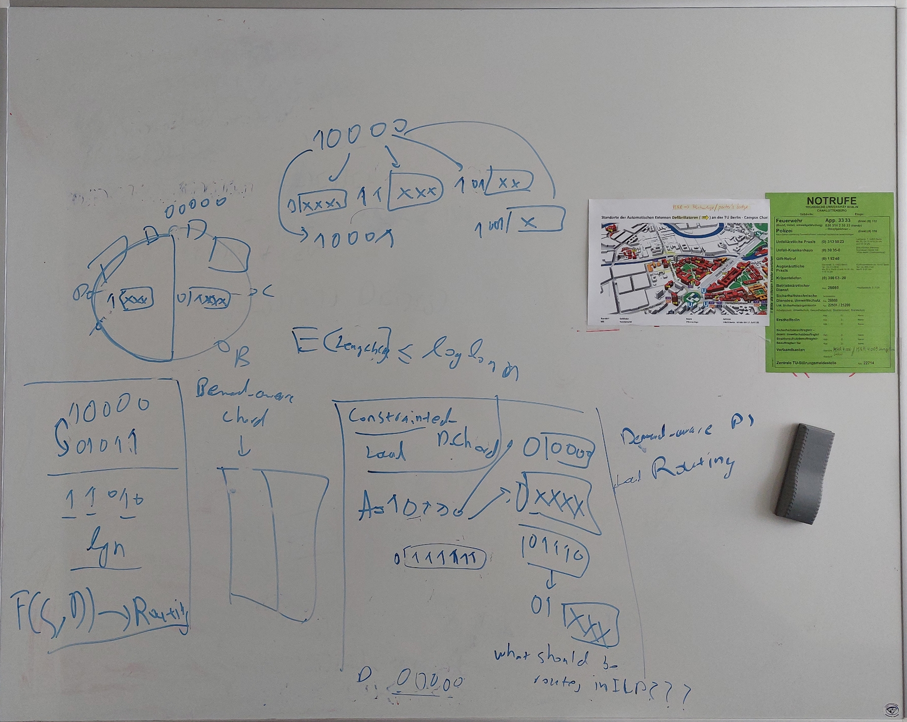

## 3. July 2022
* [quicksum](https://www.gurobi.com/documentation/9.5/refman/py_quicksum.html) -> very helpful
* SP-ILP implemented, is even more inefficient than the first ILP (flow-constraint), because we need a 3-D Helper array for the DP
* [mipfocus](https://www.gurobi.com/documentation/9.1/refman/mipfocus.html)
### What I can try tomorrow
* set [Presolve](https://www.gurobi.com/documentation/9.1/refman/presolve.html),[Cuts](https://www.gurobi.com/documentation/9.1/refman/cuts.html) 
* use [Parameter Tuning Tool](https://www.gurobi.com/documentation/9.1/refman/parameter_tuning_tool.html)

## 4. July 2022
* Conditions I look for in real datasets:
⋅⋅1. Connected
⋅⋅2. Directed with weights, But undirected can be turned into directed etc.
Optimally: All-pair connected graph with weights -> So that the weights can be turned into a Demand matrix
Datasets from Robert, which might be usable:
* Prosper loans: turn borrower into single entity, then use credit grade + rating of borrower for weights

* Last.fm songs, songs as nodes and songs listened by same person as weights

* Kademlia Routing Protocol
* Implement in ILP

* include Skipnets in thesis

