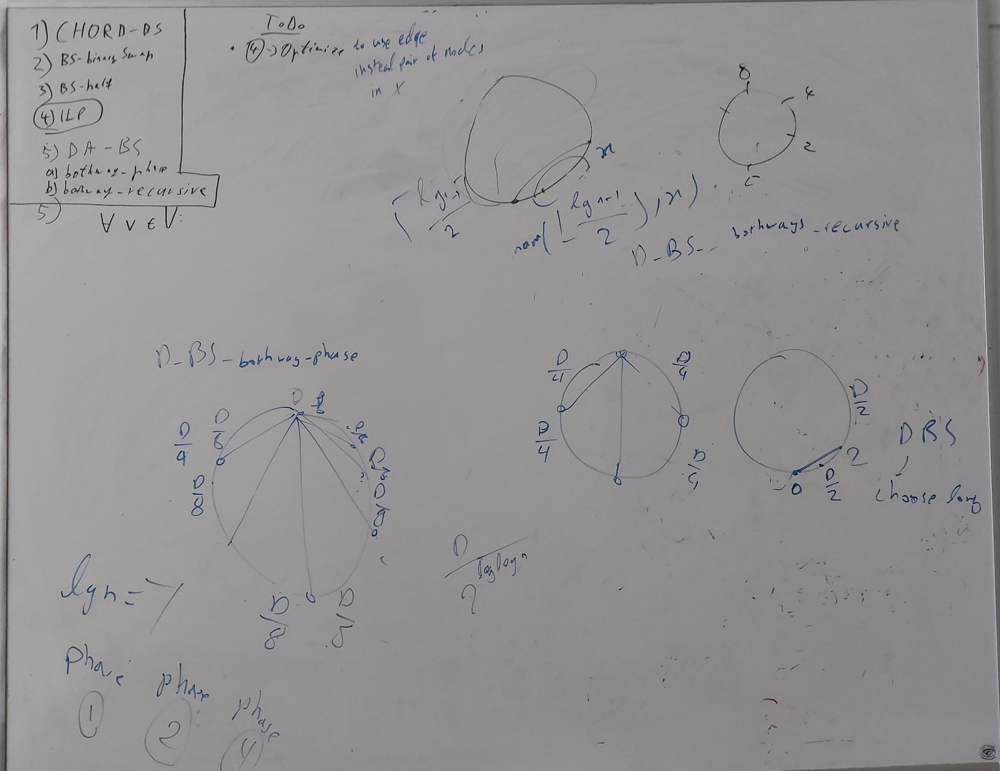
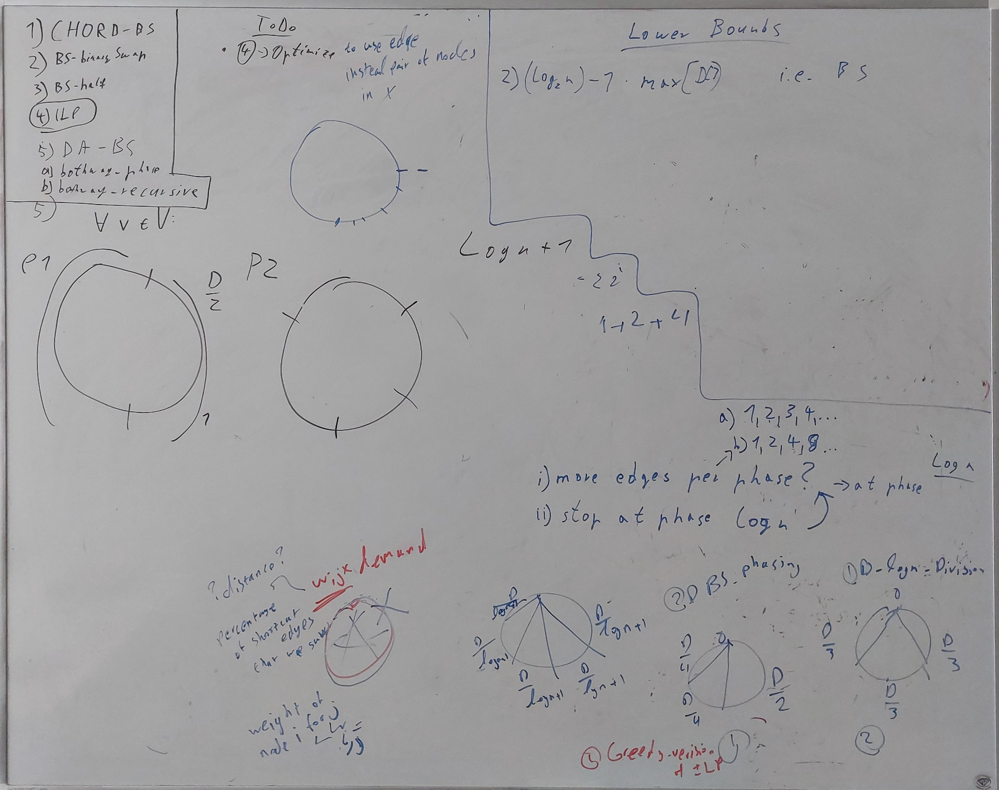
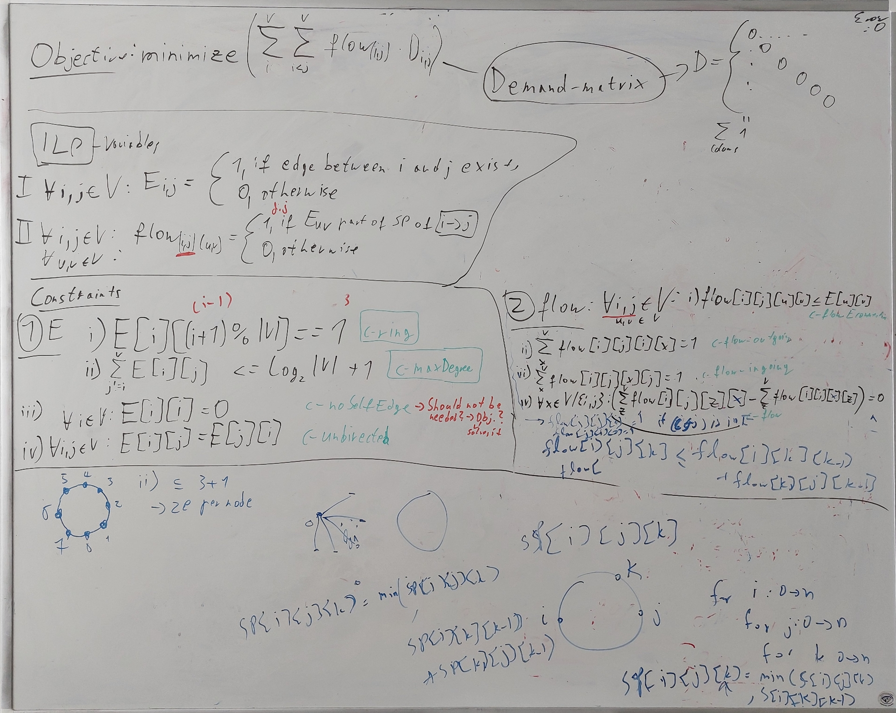
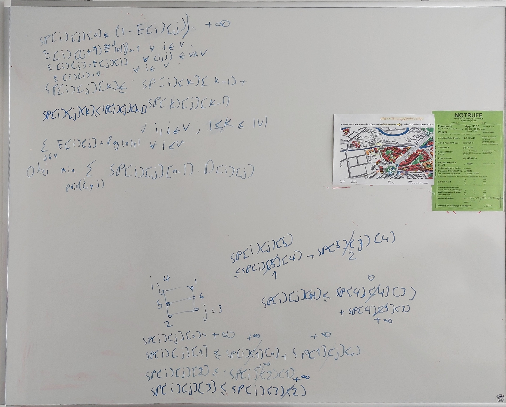

# Logbook
To keep track of goals, progress and gained Knowledge

## 27. June 2022

## 28. June 
* fixed some errors in BS_Half
* cleaned up repository
* REMEMBER: always look for example inputs (e.g. D) that breaks the algo

## 30. June

## 1. July
* Implemented new ILP
* k=0 constraint: SP[0,i,j] == ((1-e[i][j])*n)+(e[i][j])
* The constraint: SP[k][i][j] = min(SP[k-1][i][j],SP[k-1][i][k]+SP[k-1][k][j]) is not implementable in gurobi

## 2. July
* [indicator constraints](https://www.gurobi.com/documentation/9.1/refman/py_model_agc_indicator.html) do not help with the flow-constraint problem, but might be useful later
